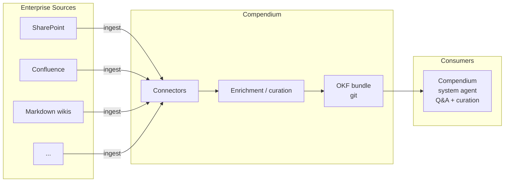

# Compendium

An OKF-first knowledge catalog for enterprise knowledge — everything an
enterprise architect needs to connect agents to the documents their
organization already has (SharePoint, Confluence, markdown wikis, and
beyond) and turn them into a living, agent-curated map of the business.

## What Compendium is

Most enterprise knowledge already exists — it's just scattered across
SharePoint sites, Confluence spaces, wikis, and shared drives, written for
humans skimming a page, not agents trying to reason about a system.
Compendium's job is to turn that sprawl into a single, coherent knowledge
catalog: a directory of interlinked concepts describing the enterprise's
architecture, systems, business processes, and integrations, kept current
by continuous ingestion and agent curation rather than a one-time export.

Compendium is **OKF-first**: every concept it produces is a plain markdown
file with YAML frontmatter, conforming to the
[Open Knowledge Format](https://github.com/GoogleCloudPlatform/knowledge-catalog/blob/main/okf/SPEC.md).
That means the catalog is:

- **Readable without Compendium.** `cat` a concept, browse the bundle in
  Obsidian or a static file server, or hand it to any LLM as context.
- **Version-controlled.** The catalog lives in git — diffs, blame, and pull
  requests are how the knowledge base evolves.
- **Portable.** No proprietary store sits between the enterprise and its
  own metadata. A bundle is a directory; it can be shipped, mirrored, or
  archived like any other.
- **Trustable at scale.** OKF's provenance, trust, and lifecycle fields
  (`sources`, `generated`, `verified`, `status`, `stale_after`) let an
  agent-maintained corpus stay honest about where a fact came from, how
  confident to be in it, and whether it's gone stale — which matters once
  most of the catalog is written by agents rather than people.

## How it fits together



1. **Connectors** pull source documents from wherever the enterprise
   already keeps them — SharePoint sites, Confluence spaces, markdown
   wikis, and other document stores — without requiring the source system
   to change.
2. **Enrichment** turns raw pages into OKF concepts: one markdown file per
   system, process, integration, or idea, with frontmatter capturing type,
   provenance, and trust, and a body written for both humans and agents.
3. **The catalog** is an OKF bundle: a versioned directory of concepts,
   cross-linked into a graph of how the enterprise's architecture, systems,
   and processes relate to one another.
4. **The Compendium system agent** is the primary way people and other
   agents interact with the catalog. It curates — proposing new concepts,
   reconciling duplicates, flagging stale or unverified knowledge — and it
   answers questions: what a system does, how two services integrate, what
   a business process depends on, and where that answer came from.

## Connectors

Enterprise architects connect Compendium to the places knowledge already
lives:

- **SharePoint**
- **Confluence**
- **Markdown wikis**
- Additional connectors as the enterprise's document landscape requires

Each connector's job is narrow: get source content and its metadata into
the enrichment pipeline. The OKF bundle it produces is the same shape
regardless of source, so the system agent and any other consumer never
need to know which connector a concept came from.

## The system agent

The Compendium system agent is the enterprise-facing surface of the
catalog. It is expected to:

- **Curate** — ingest new and changed source documents, mint or update
  concepts, link related concepts together, and surface knowledge that is
  unverified, duplicated, or past its `stale_after` date for human review.
- **Answer** — field questions about the enterprise's architecture,
  systems, business processes, and integrations, grounded in the catalog
  rather than improvised, and able to point back to the concept (and its
  `sources`) an answer came from.

## Installation

### From Source

Build the CLI and optionally install it system-wide:

```bash
# Build
./build.sh              # Linux/macOS
.\build.ps1             # Windows

# The CLI is now at ./bin/cli/Compendium.Cli
# To use it without the path prefix, add bin/cli/ to your PATH
# or copy the executable to a directory already in your PATH
```

### From GitHub Releases (when available)

```bash
# Linux/macOS
curl -fsSL https://raw.githubusercontent.com/fuseraft/compendium/main/install.sh | bash

# Windows (PowerShell)
irm https://raw.githubusercontent.com/fuseraft/compendium/main/install.ps1 | iex
```

## Building from Source

### Quick Build

```bash
# Linux/macOS
./build.sh

# Windows
.\build.ps1
```

The default target builds and publishes the CLI to `bin/cli/`.

### Build Targets

- `Build` - Compile all projects
- `Test` - Run all tests
- `PublishCli` - Publish CLI (default)
- `PublishWeb` - Publish Web server
- `PublishAll` - Publish both CLI and Web
- `Pack` - Create distribution archives
- `Lint` - Check code formatting

### Examples

```bash
# Build both CLI and Web
./build.sh --target=PublishAll

# Create self-contained Linux binary
./build.sh --target=Pack --runtime=linux-x64

# Windows self-contained binary
.\build.ps1 -Target Pack -Runtime win-x64

# Debug build
.\build.ps1 -Configuration Debug -Target Build
```

## Setup

Compendium talks to any OpenAI-compatible provider (a litellm proxy, for
example) via a base URL, API key, and model name. 

First, build the CLI:

```bash
./build.sh              # Linux/macOS
.\build.ps1             # Windows
```

Then configure it interactively — it will offer a pick-list of available 
models fetched from the provider:

```bash
compendium init
```

## Using Compendium

### Web UI

Run the Blazor Server web interface for a visual catalog browser and chat:

```bash
# Build the web server
./build.sh --target=PublishWeb    # Linux/macOS
.\build.ps1 -Target PublishWeb    # Windows

# Run the server
./bin/web/Compendium.Web          # Linux/macOS
.\bin\web\Compendium.Web.exe      # Windows
```

Then open http://localhost:5050 in your browser. The web UI provides:
- **Catalog browser** with filtering and search
- **Concept viewer** with rendered markdown
- **Chat interface** for asking questions
- **REST API** at `/api/concepts` for programmatic access

Configure the bundle path and LLM settings in `src/Compendium.Web/appsettings.json`.

### CLI

Start a terminal chat session with the system agent:

```bash
# If you added bin/cli/ to your PATH:
compendium chat --bundle catalog/sample

# Or use the full path:
./bin/cli/Compendium.Cli chat --bundle catalog/sample
```

By default the session is read-only: the agent can only look things up
(`ListConcepts`, `ReadConcept`, `SearchConcepts`). Pass `--allow-write` to
also give it curation tools for that session:

```bash
compendium chat --bundle catalog/sample --allow-write
```

- `CreateConcept` — mint a new concept.
- `UpdateConceptBody` — replace a concept's body.
- `AddLink` — link one concept to another under a section heading.
- `FlagForReview` — note a concept as stale/duplicated/unverified in
  `log.md`, without changing the concept itself.

Every one of these always writes `status: draft`, attributed to the agent
(`generated: { by: agent:compendium-agent/0.1, ... }`) — the agent can
never promote a concept to `stable` or set `verified`; that stays a human
editing the file directly.

## Ingesting documents

`compendium ingest` turns raw source files into OKF concepts. It's format-
aware: what counts as "one concept" depends on what kind of content the
source file actually holds — a whole document, a row, a message, a diagram
page, or a modeling element.

```bash
compendium ingest --source <file-or-dir> --bundle <bundlePath> [--type <ConceptType>]
```

- `--source` — a single file, or a directory walked recursively.
- `--bundle` — the OKF bundle to write into; created if it doesn't exist.
- `--type` — the concept type recorded in frontmatter, and the name of the
  folder concepts are written into (lowercased, spaces→hyphens, pluralized —
  e.g. `--type "Architecture Element"` writes to `architecture-elements/`).
  Defaults to `Document`.

### Supported formats

| Extension(s) | One concept per... | Concept text is... |
| --- | --- | --- |
| `.txt`, `.md` | whole file | the file's raw text |
| `.json`, `.xml` | whole file — unless the root is an array (JSON) or has repeating same-named children (XML), in which case it's one per array element/child | the value, pretty-printed; every scalar property/child becomes frontmatter metadata, and a `title`/`name`/`id`-like property is used as the title |
| `.pdf`, `.docx` | whole file | extracted body text |
| `.csv`, `.xlsx` | row (per worksheet, for `.xlsx`) | every column rendered as `Header: value`; every column also becomes frontmatter metadata. Title comes from a `Name`/`Title` column if present, else falls back to `<file> row N` |
| `.eml`, `.msg` | message | the email body; from/to/date become metadata, subject becomes the title |
| `.ost` | message inside the mailbox | same as `.eml`/`.msg` — each message is mirrored into `references/` individually, since the mailbox itself is one large opaque binary blob, not a useful link target for a single message |
| `.drawio`, `.vsdx` | page/tab | a rendered shape list plus labeled connections (`Shapes: A, B, C` / `- A -> B (label: ...)`) — diagrams are graphs, not prose, so the text preserves structure instead of flattening it |
| `.archimate` | ArchiMate element (Application Component, Business Actor, Node, ...) | the element's type and layer, plus every typed relationship (Serving, Realization, Assignment, ...) it's a source or target of, rendered as `- A -> B (RelationshipType)` |

Archi's native model format is supported for `.archimate`; the Open Group's
tool-interop exchange format is not.

### What a generated concept looks like

Every concept gets the same OKF frontmatter shape regardless of source
format (`src/Compendium.Ingest/ConceptBuilder.cs`):

- `type` — from `--type`.
- `title` / `description` — `description` is auto-summarized from the
  concept text (first sentence, or the first 240 characters).
- `tags: [imported, <format>]` — e.g. `imported, archimate`.
- `status: draft` — auto-ingested content is unreviewed until a human
  promotes it to `stable`. The system agent can create and edit concepts,
  but everything it writes stays `draft`; only a human can mark a concept
  `stable` or set the separate `verified` field.
- `generated: { by: process:compendium-ingest/0.1, at: <UTC timestamp> }`.
- `sources` — points back at the file mirrored into `<bundle>/references/`,
  so every concept traces to the exact bytes it came from.
- Any format-specific fields from the table above (e.g. `shape_count`,
  `archimate_type`, `layer`) are flattened into frontmatter and repeated in
  a `# Details` section in the body.

Unsupported extensions are skipped, not silently dropped, and a failure to
parse one file never aborts the run — `compendium ingest` reports
processed/written/skipped/failed counts so nothing goes missing quietly.

### Verification status

Every extractor is covered by `dotnet test` (`tests/Compendium.Ingest.Tests`)
and has been smoke-tested end-to-end (`ingest` then `chat` against a real
model, confirming grounded, cited answers). Two paths are implemented from
well-documented public knowledge of their format rather than against a real
export from the producing application, since no genuine sample file was
available to verify against in the environment these were built in:

- **Compressed `.drawio`** — draw.io's default save format (deflate +
  base64 + URI-encoded XML). Round-trip self-tested against my own encoder,
  not a real draw.io export. Uncompressed `.drawio` files (common when kept
  diffable in git) are fully verified.
- **`.archimate`** — parsed from Archi's documented native XML shape, not
  verified against a real Archi-application export.

`.msg` and `.ost` byte-level parsing (via MsgReader) are likewise unverified
against real-world binary samples, for the same reason — none were
available to test against.

If you ingest a real file in one of these formats and something looks off,
that's the most likely place to look first.

This generic pipeline intentionally does not attempt domain-specific
cross-linking (e.g. resolving system aliases across an integration
catalog) — that kind of enrichment stays a bespoke, per-bundle step on top
of the generic concepts `ingest` produces.

## Status

Compendium is early-stage: this README describes the intended shape of the
project. Connectors, the enrichment pipeline, and the system agent are
being built out; see the repository's issues/roadmap for current progress.

## Relationship to OKF

Compendium consumes and produces the [Open Knowledge Format](https://github.com/GoogleCloudPlatform/knowledge-catalog/blob/main/okf/SPEC.md)
(v0.2) as its bundle format. It does not fork or redefine the spec —
any OKF-conformant bundle, however it was produced, is a bundle Compendium
can curate and answer questions over.
