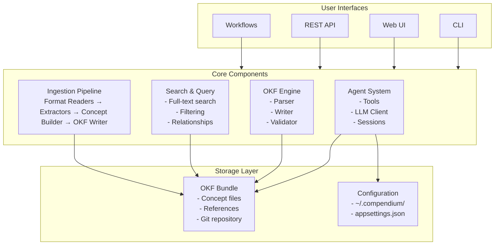

# Architecture

This document describes Compendium's system architecture, design decisions, and component interactions.

## System Overview



## Project Structure

### Source Projects

```
src/
├── Compendium.Cli/           # Command-line interface
│   ├── Commands/             # CLI command handlers
│   ├── Interactive/          # Chat session logic
│   └── Program.cs            # Entry point
│
├── Compendium.Web/           # Blazor Server web UI
│   ├── Pages/                # Razor pages
│   ├── Components/           # Reusable UI components
│   ├── Services/             # Web-specific services
│   └── API/                  # REST API controllers
│
├── Compendium.Core/          # Core OKF logic (no dependencies)
│   ├── Models/               # Concept, Bundle, Frontmatter
│   ├── Parsing/              # YAML + Markdown parsing
│   ├── Writing/              # OKF file writing
│   ├── Validation/           # OKF spec conformance
│   └── Query/                # Search and filtering
│
├── Compendium.Agent/         # AI agent system
│   ├── Tools/                # Agent tool implementations
│   ├── Sessions/             # Chat session management
│   ├── LLM/                  # OpenAI-compatible client
│   └── Prompts/              # System prompts
│
├── Compendium.Ingest/        # Document ingestion
│   ├── Readers/              # Format-specific readers
│   │   ├── PdfReader.cs
│   │   ├── ExcelReader.cs
│   │   ├── ArchimateReader.cs
│   │   └── ...
│   ├── Extractors/           # Content extraction logic
│   ├── ConceptBuilder.cs     # Transforms to OKF concepts
│   └── Pipeline.cs           # Orchestrates ingestion
│
└── Compendium.Connectors/    # External source connectors (future)
    ├── SharePoint/
    ├── Confluence/
    └── Git/
```

### Test Projects

```
tests/
├── Compendium.Core.Tests/    # Core functionality tests
├── Compendium.Ingest.Tests/  # Ingestion pipeline tests
├── Compendium.Agent.Tests/   # Agent system tests
└── Integration.Tests/         # End-to-end tests
```

## Core Components

### OKF Engine (`Compendium.Core`)

**Purpose:** Read, write, and validate OKF concepts.

**Key Classes:**

- **`Concept`** — In-memory representation of an OKF concept
  - `Frontmatter` — YAML metadata
  - `Body` — Markdown content
  - `Sources` — Provenance links

- **`ConceptReader`** — Parses `.md` files into `Concept` objects
  - Uses `YamlDotNet` for frontmatter
  - Uses `Markdig` for markdown parsing

- **`ConceptWriter`** — Writes `Concept` objects to `.md` files
  - Generates valid YAML frontmatter
  - Preserves markdown formatting

- **`BundleManager`** — Manages OKF bundle directories
  - Lists concepts
  - Resolves concept IDs to file paths
  - Handles type-based directory organization

- **`ConceptValidator`** — Validates OKF spec conformance
  - Required fields check
  - Valid status values
  - Source file references

**No Dependencies:** Core is intentionally dependency-light — only YAML and Markdown parsing libraries. No LLM, no web framework, no database.

### Agent System (`Compendium.Agent`)

**Purpose:** AI-powered curation and Q&A.

**Key Classes:**

- **`CompendiumAgent`** — Main agent orchestrator
  - Manages chat sessions
  - Routes tool calls
  - Handles LLM communication

- **`AgentTool`** (abstract) — Base class for agent tools
  - `ListConcepts`
  - `ReadConcept`
  - `SearchConcepts`
  - `CreateConcept`
  - `UpdateConceptBody`
  - `AddLink`
  - `FlagForReview`

- **`LlmClient`** — OpenAI-compatible API client
  - Streaming support
  - Tool call parsing
  - Error handling and retries

- **`ChatSession`** — Manages conversation state
  - Message history
  - Context management
  - Tool results tracking

**Tool Design:** Each tool is a separate class implementing `AgentTool`:

```csharp
public abstract class AgentTool
{
    public abstract string Name { get; }
    public abstract string Description { get; }
    public abstract JsonObject Schema { get; }
    public abstract Task<string> ExecuteAsync(JsonObject parameters);
}
```

### Ingestion Pipeline (`Compendium.Ingest`)

**Purpose:** Transform source documents into OKF concepts.

**Architecture:**

```
Source File
    ↓
Format Detection (by extension)
    ↓
Reader (format-specific)
    ↓
Extractor (transforms to intermediate format)
    ↓
ConceptBuilder (generates OKF frontmatter + body)
    ↓
ConceptWriter (writes .md file)
    ↓
Reference Mirroring (copies original to references/)
```

**Key Classes:**

- **`IngestionPipeline`** — Orchestrates ingestion
  - File discovery
  - Format dispatching
  - Error handling
  - Progress reporting

- **`IDocumentReader`** (interface) — Format-specific readers
  - `PdfReader` — Extracts text from PDFs
  - `ExcelReader` — Reads spreadsheets
  - `ArchimateReader` — Parses ArchiMate XML
  - `DrawioReader` — Extracts draw.io diagrams
  - ...14+ implementations

- **`ConceptBuilder`** — Generates OKF concepts
  - Auto-generates titles and descriptions
  - Populates frontmatter
  - Sets `status: draft`
  - Adds `generated` attribution
  - Creates `sources` links

**Data Map Detection:** Special logic in `ExcelReader` and `CsvReader`:

```csharp
if (HasColumns("Int Name", "SRC Column", "DST Column"))
{
    // Group rows by Int Name
    // One concept per integration
    // Extract source/destination systems
}
else
{
    // One concept per row
}
```

### Web UI (`Compendium.Web`)

**Purpose:** Browser-based catalog management.

**Technology Stack:**
- Blazor Server (server-rendered, WebSocket-based)
- SignalR (real-time updates)
- Material Design components

**Key Pages:**

- **`/` (Index)** — Catalog browser
  - Lists all concepts
  - Filters by type, tag, status
  - Search bar

- **`/concept/{id}`** — Concept viewer
  - Rendered markdown
  - Frontmatter display
  - Source links

- **`/chat`** — Chat interface
  - Agent interaction
  - Tool call visibility
  - Citation links

- **`/review`** — Draft review
  - List drafts
  - Approve/reject
  - Inline editing

- **`/ingest`** — Upload interface
  - File upload
  - Progress tracking

- **`/settings`** — Configuration
  - Bundle path
  - LLM settings
  - Permissions

**REST API:**
- `/api/concepts` — List concepts
- `/api/concepts/{id}` — Get concept
- `/api/concepts/search` — Search
- `/api/concepts` (POST) — Create concept

### CLI (`Compendium.Cli`)

**Purpose:** Terminal-based interaction.

**Command Structure:**

```
compendium
├── init              # Initialize configuration
├── ingest            # Ingest documents
├── chat              # Interactive chat
├── list              # List concepts
├── read              # Read concept
├── search            # Search concepts
├── create            # Create concept
├── update            # Update concept
├── delete            # Delete concept
├── validate          # Validate bundle
├── export            # Export to other formats
└── stats             # Show bundle statistics
```

**Implementation:** Uses `System.CommandLine` for parsing.

## Data Flow

### Ingestion Flow

```
1. User runs: compendium ingest --source docs/ --bundle catalog/

2. IngestionPipeline discovers files:
   docs/
   ├── arch.pdf
   ├── data-map.xlsx
   └── diagram.drawio

3. For each file:
   a. Detect format → PdfReader, ExcelReader, DrawioReader
   b. Extract content → text, rows, shapes
   c. Build concept → ConceptBuilder generates OKF
   d. Write concept → catalog/documents/arch.md
   e. Mirror source → catalog/references/arch.pdf

4. Report results:
   Processed: 3 files
   Written: 3 concepts
```

### Chat Flow

```
1. User sends message: "List all systems"

2. CompendiumAgent:
   a. Adds message to chat history
   b. Calls LLM with system prompt + tools
   c. LLM responds with tool call: ListConcepts(type="System")

3. AgentTool executes:
   a. BundleManager.ListConcepts(filter: type=System)
   b. Returns concept summaries

4. CompendiumAgent:
   a. Adds tool result to history
   b. Calls LLM again with results
   c. LLM synthesizes natural language response

5. User sees: "Found 15 system concepts: ..."
```

### Web UI Flow

```
1. User navigates to /concept/systems/order-management

2. ConceptViewerPage:
   a. Calls BundleManager.ReadConcept(id)
   b. Concept loaded from disk
   c. Markdown rendered to HTML (Markdig)
   d. Frontmatter displayed as table

3. User clicks "Chat"

4. ChatPage:
   a. Creates ChatSession
   b. Loads bundle context
   c. User sends message
   d. CompendiumAgent processes (same as CLI)
   e. SignalR pushes response to browser
```

## Design Principles

### 1. OKF-First

All data is stored as OKF concepts. No database sits between concepts and consumers — everything is plain markdown files with YAML frontmatter.

**Benefits:**
- Human-readable
- Version-controlled (git)
- Portable (no proprietary format)
- Tool-agnostic (any text editor works)

### 2. Separation of Concerns

Each project has a clear, narrow responsibility:

- **Core** — OKF parsing/writing (no LLM, no web)
- **Agent** — LLM interaction (no ingestion, no web)
- **Ingest** — Document transformation (no LLM, no web)
- **Web** — UI only (delegates to Core/Agent)
- **CLI** — Commands only (delegates to Core/Agent)

### 3. Tool-Based Agent Architecture

The agent doesn't "know" how to read concepts — it calls tools. This makes it easy to:

- Add new tools (just implement `AgentTool`)
- Test tools independently
- Control permissions (enable/disable tools)
- Audit actions (log tool calls)

### 4. Draft-by-Default

All ingested and agent-generated content starts as `status: draft`. Only humans can promote to `stable`. This ensures:

- Human verification gate
- Clear trust boundaries
- Easy rollback (delete drafts)

### 5. Provenance Tracking

Every concept traces back to its source:

```yaml
sources:
  - id: original-file
    resource: /references/architecture.pdf
    title: "Architecture Document v2.3"
generated:
  by: process:compendium-ingest/0.1
  at: 2026-08-16T10:30:00Z
```

This enables:
- Verification against source
- Staleness detection
- Compliance (where did this come from?)

## Technology Choices

### .NET 10 / C#

**Why:** Modern, cross-platform, performant, excellent tooling.

**Alternatives considered:**
- Python — Slower, weaker typing, but more ML library support
- Go — Fast, simple, but less rich ecosystem for LLM clients
- TypeScript — Good for web, but .NET better for CLI and ingestion

### Blazor Server (Web UI)

**Why:** .NET-native, server-rendered, real-time (SignalR), shares code with backend.

**Alternatives considered:**
- React/Next.js — More ecosystem, but requires separate API
- Blazor WebAssembly — Client-side, but larger downloads and more complex state

### OpenAI-Compatible API

**Why:** De facto standard for LLMs. Works with OpenAI, Azure OpenAI, litellm proxy, and most LLM providers.

**No Langchain:** Intentionally avoided — direct API calls give more control and less abstraction overhead.

### YamlDotNet + Markdig

**Why:** Mature, well-tested libraries for YAML and Markdown.

### No Database

**Why:** OKF is the database. Concepts are files, bundles are directories. No need for PostgreSQL/SQLite/etc.

**Future:** May add optional indexing (SQLite FTS, Lucene) for large bundles, but concepts remain the source of truth.

## Performance Considerations

### Scalability Limits

**Bundle Size:** Tested with 1000+ concepts without issues. Web UI may slow down beyond ~5000 concepts — pagination recommended.

**Ingestion:** CPU-bound (PDF extraction, XML parsing). Parallelizable per-file.

**Agent:** LLM API latency is the bottleneck (2-10 seconds per query). Concept reading is fast (<1ms per concept).

### Optimization Strategies

1. **Lazy Loading** — Web UI loads concepts on-demand
2. **Streaming** — Agent responses stream token-by-token
3. **Caching** — Concept metadata cached in memory
4. **Incremental Ingestion** — Only process changed files (future)
5. **Indexing** — Optional full-text index (future)

## Security Considerations

### Authentication

Web UI has no built-in auth. Deploy behind:
- Reverse proxy with Basic Auth
- OAuth proxy (oauth2-proxy)
- VPN / internal network only

### Authorization

Agent tools controlled by `--allow-write` flag. No concept-level permissions (yet).

### Input Validation

- YAML frontmatter validated against schema
- Markdown sanitized before rendering (prevent XSS)
- File paths validated (prevent directory traversal)
- LLM responses treated as untrusted

### Secrets Management

API keys stored in:
- The OS credential store — Windows Credential Manager, macOS Keychain, or
  Linux Secret Service (`secret-tool`) — written by `compendium init` or
  the Web UI's Settings page, either of which configures both the CLI and
  the Web UI. Never written to disk in plaintext; if no keychain is
  reachable, both surfaces fail with an error pointing at `LITELLM_API_KEY`
  instead of silently degrading
- `LITELLM_API_KEY` environment variable, as a CI/scripting fallback
- Not in bundles (git-ignored), and never in a repo-tracked config file

## Future Architecture

### Planned Enhancements

1. **Multi-Bundle Support** — Query across multiple catalogs
2. **Semantic Search** — Vector embeddings for similarity search
3. **Event System** — Pub/sub for concept changes
4. **Plugin Architecture** — Custom tools and extractors
5. **Distributed Mode** — Sync bundles across instances

### Connector System

Planned: Abstract connector interface for pluggable sources.

```csharp
public interface IConnector
{
    Task<IEnumerable<SourceDocument>> DiscoverAsync();
    Task<SourceDocument> ExtractAsync(string id);
    ConceptBuilder Transform(SourceDocument doc);
}
```

Implementations: SharePoint, Confluence, Git, Jira, etc.

## Next Steps

- [Building Guide](building.md) — Build from source
- [Contributing Guide](contributing.md) — Submit changes
- [OKF Format](../features/okf.md) — Understand the data model
