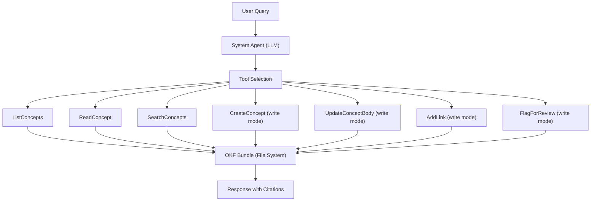

# AI Agent

The Compendium system agent is an AI-powered assistant that curates and answers questions about your knowledge catalog. It understands OKF concepts, can maintain the catalog over time, and provides grounded, traceable answers.

## Capabilities

### Query and Search

In **read-only mode**, the agent can:

- **List concepts** — Browse the catalog by type, tag, or status
- **Read concepts** — View full concept content and metadata
- **Search** — Full-text search across all concepts
- **Answer questions** — Provide contextual answers grounded in the catalog
- **Trace lineage** — Follow relationships between concepts

Example queries:

```
List all systems
What does the Order Management System do?
Search for concepts about authentication
Which integrations read from the CoreDB database?
Show me the data lineage for customer emails
```

### Curation and Maintenance

In **write mode** (`--allow-write`), the agent can also:

- **Create concepts** — Mint new concepts from descriptions or documents
- **Update concepts** — Revise concept content as knowledge evolves
- **Link concepts** — Connect related concepts together
- **Flag for review** — Mark concepts as stale, duplicated, or unverified

!!! warning "Draft status for agent changes"
    All agent-created or agent-modified concepts remain `status: draft` until a human reviews and promotes them to `stable`. The agent can never set `status: stable` or add `verified` metadata.

## Agent Architecture



The agent:

1. Receives a natural language query
2. Selects appropriate tools to gather information
3. Reads/writes OKF concepts on the file system
4. Synthesizes a response with source citations
5. Returns structured, traceable answers

## Available Tools

### Read-Only Tools (Always Available)

#### `ListConcepts`
Lists all concepts in the bundle, optionally filtered.

Parameters:
- `type` (optional) — Filter by concept type
- `tag` (optional) — Filter by tag
- `status` (optional) — Filter by status

Returns: Array of concept summaries (id, type, title, status)

#### `ReadConcept`
Reads a specific concept's full content.

Parameters:
- `id` (required) — Concept ID (e.g., "systems/order-management")

Returns: Full concept (frontmatter + body)

#### `SearchConcepts`
Full-text search across concept titles, descriptions, and bodies.

Parameters:
- `query` (required) — Search query
- `type` (optional) — Filter results by type
- `limit` (optional) — Max results (default: 10)

Returns: Array of matching concepts with snippets

#### `ListConceptsByType`
Lists all concepts of a specific type.

Parameters:
- `type` (required) — Concept type

Returns: Array of concept summaries

#### `GetConceptMetadata`
Retrieves only the frontmatter of a concept (faster than ReadConcept).

Parameters:
- `id` (required) — Concept ID

Returns: Frontmatter object

### Write Tools (Requires `--allow-write`)

#### `CreateConcept`
Creates a new concept.

Parameters:
- `type` (required) — Concept type
- `title` (required) — Concept title
- `body` (required) — Markdown body content
- `description` (optional) — One-line summary
- `tags` (optional) — Array of tags

Returns: Created concept ID

Behavior:
- Sets `status: draft`
- Sets `generated.by: agent:compendium/version`
- Writes to `<bundle>/<type-plural>/<slug>.md`

#### `UpdateConceptBody`
Updates an existing concept's body content.

Parameters:
- `id` (required) — Concept ID
- `body` (required) — New markdown body

Returns: Success confirmation

Behavior:
- Updates `generated.at` timestamp
- Preserves `status` (never promotes to stable)
- Keeps existing frontmatter

#### `AddLink`
Creates a relationship between two concepts.

Parameters:
- `source_id` (required) — Source concept ID
- `target_id` (required) — Target concept ID
- `section` (optional) — Section heading to add link under (default: "## Related")

Returns: Success confirmation

Behavior:
- Adds markdown link in specified section
- Updates `generated.at` timestamp
- Bidirectional links must be added separately

#### `FlagForReview`
Marks a concept for human review without modifying it.

Parameters:
- `id` (required) — Concept ID
- `reason` (required) — Why it needs review (stale, duplicate, unverified, etc.)
- `details` (optional) — Additional context

Returns: Success confirmation

Behavior:
- Appends entry to `<bundle>/log.md`
- Does not modify the concept itself
- Log entries include timestamp and agent attribution

## Trust and Safety

### Draft Status

All agent-created or modified content starts as `draft`:

```yaml
status: draft
generated:
  by: agent:compendium/0.1
  at: 2026-08-16T10:30:00Z
```

### Human-Only Promotion

Only humans can promote concepts to `stable`:

```yaml
status: stable
verified:
  by: user:architect-team
  at: 2026-08-16T14:00:00Z
```

This ensures:
- **Verification gate** — All agent work reviewed before trusted
- **Accountability** — Clear attribution for who approved what
- **Rollback** — Easy to identify and revert agent changes

### Provenance Tracking

Every agent action is attributed:

```yaml
generated:
  by: agent:compendium/0.1
  at: 2026-08-16T10:30:00Z
sources:
  - id: agent-conversation
    title: "Created during chat session 2026-08-16"
```

### Audit Trail

With git version control, all agent changes are traceable:

```bash
# See all agent commits
git log --author="agent:compendium" --oneline

# Review a specific change
git show abc123

# Revert an agent change
git revert abc123
```

## Usage Patterns

### Discovery and Research

```
User: What systems are documented?
Agent: [Uses ListConceptsByType] Found 45 System concepts...

User: Tell me about the Payment Gateway
Agent: [Uses ReadConcept] The Payment Gateway processes payments via Stripe...

User: Which integrations use the Payment Gateway?
Agent: [Uses SearchConcepts] Found 3 integrations: Order-to-Payment, Subscription-Renewal...
```

### Knowledge Maintenance

```
User: Create a concept for the new Analytics API
Agent: [Uses CreateConcept] Created systems/analytics-api.md (draft)

User: Link it to the Data Warehouse
Agent: [Uses AddLink] Linked Analytics API → Data Warehouse

User: Is the Inventory System concept still accurate?
Agent: [Reads concept, checks dates] The concept mentions Server-01 which was decommissioned.
     [Uses FlagForReview] Flagged for review in log.md
```

### Curation Workflow

1. **Ingest** documents → Creates draft concepts
2. **Agent enrichment** → Agent links related concepts, fills in gaps
3. **Human review** → Review drafts via web UI or CLI
4. **Promotion** → Human marks reviewed concepts as `stable`
5. **Ongoing maintenance** → Agent flags stale concepts, proposes updates

## Best Practices

### 1. Start Read-Only

Default to read-only mode for queries:

```bash
compendium chat --bundle my-catalog
```

Enable write mode only when actively curating:

```bash
compendium chat --bundle my-catalog --allow-write
```

### 2. Review Agent Changes

Use git to review before promoting:

```bash
# See what the agent changed
git diff

# Review specific concept
cat systems/new-concept.md

# Approve if good
compendium update --bundle my-catalog --id systems/new-concept --status stable
```

### 3. Use Verification Metadata

When promoting to stable, add verification:

```yaml
status: stable
verified:
  by: user:yourname
  at: 2026-08-16T14:00:00Z
```

### 4. Set Staleness Dates

For time-sensitive knowledge:

```yaml
stale_after: 2027-02-16
```

Agent can flag concepts past this date for re-review.

### 5. Monitor the Log

Check `log.md` regularly for flagged concepts:

```bash
cat my-catalog/log.md | grep "agent:compendium" | tail -10
```

## Model Selection

Different models offer different trade-offs:

### Fast Models
- **GPT-3.5-turbo** — Quick responses, good for simple queries
- **Claude Haiku** — Fast and cost-effective
- Good for: Browsing, searching, simple Q&A

### Capable Models
- **GPT-4** — Strong reasoning, thorough answers
- **Claude Sonnet** — Balanced capability and speed
- Good for: Complex queries, curation, relationship inference

### Specialized Models
- **GPT-4-turbo** — Long context, handles large bundles
- **Claude Opus** — Most capable, best for complex curation
- Good for: Large-scale curation, complex lineage tracing

The model isn't a per-session flag — configure it once via `compendium init`
or the Web UI's Settings page (either one applies to both surfaces), or set
the `LITELLM_MODEL` environment variable for CI/scripting use.

## Limitations

### What the Agent Can't Do

- **Promote to stable** — Only humans can mark concepts as verified
- **Delete concepts** — Requires explicit human action
- **Cross-bundle operations** — Works within one bundle at a time
- **External API calls** — No direct access to SharePoint, Confluence, etc.
- **Arbitrary code execution** — Tool calls are limited to OKF operations

### Known Constraints

- **Context limits** — Large bundles may exceed model context windows
- **Hallucination** — May create plausible but incorrect content (review required)
- **Format understanding** — Best with well-structured OKF concepts
- **Relationship inference** — May miss subtle connections

## Future Enhancements

Planned capabilities:

- **Semantic search** — Vector embeddings for similarity search
- **Auto-linking** — Detect implicit relationships across concepts
- **Duplicate detection** — Flag similar or redundant concepts
- **Batch operations** — Update multiple concepts in one operation
- **Scheduled curation** — Periodic staleness checks and maintenance
- **Multi-bundle queries** — Search across multiple catalogs

## Next Steps

- [Chat Interface Guide](../guide/chat.md)
- [CLI Reference](../guide/cli.md)
- [Web UI Guide](../guide/web-ui.md)
- [OKF Format](okf.md)
