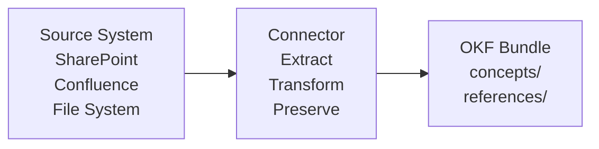

# Connectors

Connectors enable Compendium to ingest content from enterprise knowledge sources like SharePoint, Confluence, and file systems. Each connector transforms source documents into OKF concepts while preserving provenance.

## Overview

Connectors are the bridge between where enterprise knowledge lives and the OKF bundle format. They:

1. **Access** source systems (SharePoint sites, Confluence spaces, file servers)
2. **Extract** documents and metadata
3. **Transform** content into OKF concepts
4. **Preserve** original files in `references/` for provenance



## Built-In Connectors

### File System Connector

The primary connector, accessed via `compendium ingest`.

**Supports:**
- Local directories
- Network file shares
- Mounted volumes
- Git repositories

**Usage:**

```bash
compendium ingest --source /path/to/docs --bundle my-catalog --type Document
```

**Features:**
- Recursive directory traversal
- 14+ file format support
- Format-specific extraction logic
- Automatic data map detection

See [Ingestion Guide](../guide/ingestion.md) for details.

### Git Repository Connector

Clone and ingest git repositories directly.

**Usage:**

```bash
# Clone first
git clone https://github.com/example/docs.git /tmp/docs

# Then ingest
compendium ingest --source /tmp/docs --bundle my-catalog --type Document
```

**Best Practice:** Track source repo commit hash in frontmatter:

```yaml
sources:
  - id: git-repo
    resource: https://github.com/example/docs
    title: "Documentation Repository"
    commit: abc123def456
```

## Planned Connectors

### SharePoint Connector

Extract content from SharePoint sites and libraries.

**Planned Features:**
- Site and library traversal
- Document metadata extraction (author, modified date, version)
- Managed metadata and taxonomy integration
- Incremental updates (delta sync)
- Permissions mapping (visibility metadata)

**Planned Usage:**

```bash
compendium connect sharepoint \
  --site https://company.sharepoint.com/sites/architecture \
  --bundle my-catalog \
  --type Document \
  --auth interactive
```

### Confluence Connector

Ingest content from Confluence spaces.

**Planned Features:**
- Space and page hierarchy traversal
- Attachments extraction
- Labels → tags mapping
- Page relationships preservation
- Version history tracking

**Planned Usage:**

```bash
compendium connect confluence \
  --space "EA" \
  --url https://company.atlassian.net \
  --bundle my-catalog \
  --type Document \
  --token $CONFLUENCE_TOKEN
```

### Markdown Wiki Connector

Ingest from markdown-based wikis (GitHub Wiki, GitLab, etc.).

**Planned Features:**
- Wiki page extraction
- Cross-reference resolution
- Image and asset handling
- Sidebar/navigation preservation

**Planned Usage:**

```bash
compendium connect wiki \
  --url https://github.com/example/repo/wiki \
  --bundle my-catalog \
  --type Document
```

## Connector Architecture

### Common Pipeline

All connectors follow the same pattern:

1. **Authentication** — Obtain credentials/tokens
2. **Discovery** — List available documents
3. **Extraction** — Download content and metadata
4. **Transformation** — Convert to OKF format
5. **Preservation** — Mirror originals to `references/`
6. **Writing** — Create concept files

### Metadata Mapping

Connectors map source metadata to OKF frontmatter:

| Source | OKF Field |
|--------|-----------|
| Author | `generated.by: user:author-name` |
| Modified Date | `generated.at` |
| Tags/Labels | `tags` |
| Status | `status` (draft by default) |
| Version | `sources[].version` |
| URL | `sources[].resource` |

### Incremental Updates

For sources that change over time:

- **First run** — Ingest all content
- **Subsequent runs** — Detect changes and update only modified concepts
- **Tracking** — Use `generated.at` and `sources[].last_updated` to identify stale concepts

## Authentication

### Supported Methods

#### Interactive Browser Auth
User logs in via browser, connector receives token.

```bash
compendium connect sharepoint --site ... --auth interactive
```

#### API Token
Pre-configured token or API key.

```bash
export SHAREPOINT_TOKEN="..."
compendium connect sharepoint --site ... --auth token
```

#### Service Principal
OAuth2 client credentials for unattended access.

```bash
compendium connect sharepoint --site ... --auth service-principal \
  --client-id "..." --client-secret "..."
```

#### Configuration File
Store credentials in `~/.compendium/connectors.json`:

```json
{
  "sharepoint": {
    "site": "https://company.sharepoint.com/sites/architecture",
    "auth": {
      "type": "token",
      "token": "..."
    }
  },
  "confluence": {
    "url": "https://company.atlassian.net",
    "auth": {
      "type": "token",
      "token": "..."
    }
  }
}
```

## Error Handling

Connectors are resilient to partial failures:

- **Authentication errors** — Fail fast with clear error message
- **Network errors** — Retry with exponential backoff
- **Parse errors** — Log error, skip file, continue batch
- **Permission errors** — Log inaccessible files, continue
- **Rate limits** — Respect source system rate limits

Summary report shows:

```
Processed: 150 documents
Written: 142 concepts
Skipped: 5 unsupported formats
Failed: 3 parse errors
Rate limited: 2 retries
```

## Best Practices

### 1. Schedule Regular Syncs

Keep the catalog up-to-date with cron jobs:

```bash
# Daily sync at 2am
0 2 * * * compendium connect sharepoint --site ... --bundle my-catalog
```

### 2. Use Incremental Mode

Avoid re-ingesting unchanged content:

```bash
compendium connect sharepoint --site ... --bundle my-catalog --incremental
```

### 3. Version Control the Bundle

Commit after each sync to track changes:

```bash
#!/bin/bash
compendium connect sharepoint --site ... --bundle my-catalog
cd my-catalog
git add .
git commit -m "Sync from SharePoint $(date +%Y-%m-%d)"
git push
```

### 4. Monitor for Stale Content

Flag concepts that haven't been updated recently:

```bash
compendium list --bundle my-catalog --format json | \
  jq '.[] | select(.generated.at < "2026-01-01") | .id'
```

### 5. Preserve Source URLs

Always include source URLs in frontmatter:

```yaml
sources:
  - id: sharepoint
    resource: https://company.sharepoint.com/sites/EA/Shared%20Documents/arch.pdf
    title: "Architecture Document v2.3"
```

## Connector Configuration

### Per-Connector Settings

Create `~/.compendium/connectors.json`:

```json
{
  "sharepoint": {
    "site": "https://company.sharepoint.com/sites/architecture",
    "auth": {
      "type": "interactive"
    },
    "filters": {
      "libraries": ["Documents", "Shared Documents"],
      "exclude_folders": ["Archive", "Deprecated"]
    },
    "rate_limit": {
      "requests_per_second": 5
    }
  },
  "confluence": {
    "url": "https://company.atlassian.net",
    "spaces": ["EA", "TECH"],
    "auth": {
      "type": "token",
      "token_env": "CONFLUENCE_TOKEN"
    }
  }
}
```

### Command-Line Overrides

Override config file settings:

```bash
compendium connect sharepoint \
  --site https://other.sharepoint.com/sites/test \
  --bundle test-catalog
```

## Troubleshooting

### Authentication Failures

**Problem:** "Authentication failed" error

**Solutions:**
- Verify credentials are correct
- Check token hasn't expired
- Ensure service principal has required permissions
- Try interactive auth: `--auth interactive`

### Rate Limiting

**Problem:** "Too many requests" errors

**Solutions:**
- Reduce `rate_limit.requests_per_second` in config
- Run sync during off-peak hours
- Use incremental mode to reduce volume

### Partial Ingestion

**Problem:** Some documents missing from bundle

**Solutions:**
- Check summary report for skipped/failed files
- Verify source system permissions
- Look for unsupported file formats
- Check connector logs: `~/.compendium/logs/connector.log`

### Large Document Sets

**Problem:** Connector times out or runs out of memory

**Solutions:**
- Ingest in batches by folder/library
- Use filters to exclude non-essential content
- Increase timeout: `--timeout 3600`
- Run on a machine with more RAM

## Extending Connectors

### Custom Connector Development

Create custom connectors for proprietary systems:

```csharp
public class MyConnector : IConnector
{
    public async Task<IEnumerable<SourceDocument>> DiscoverAsync()
    {
        // List available documents
    }

    public async Task<SourceDocument> ExtractAsync(string id)
    {
        // Download and extract content
    }

    public ConceptBuilder Transform(SourceDocument doc)
    {
        // Convert to OKF concept
    }
}
```

Register in `src/Compendium.Connectors/ConnectorRegistry.cs`.

See `src/Compendium.Connectors/README.md` for developer guide.

## Roadmap

### Short Term (v0.2-0.3)
- SharePoint connector (Online and On-Premises)
- Confluence connector (Cloud and Server)
- Incremental sync mode
- Conflict resolution strategies

### Medium Term (v0.4-0.5)
- Microsoft Teams connector (channels, files)
- Google Drive connector
- Notion connector
- Scheduled sync daemon

### Long Term (v1.0+)
- Jira connector (issues, projects)
- Slack connector (messages, files)
- Email connector (Exchange, Gmail)
- Database connector (metadata extraction)

## Next Steps

- [Ingestion Guide](../guide/ingestion.md) — Using the file system connector
- [Configuration](../getting-started/configuration.md) — Setting up credentials
- [OKF Format](okf.md) — Understanding the target format
- [Contributing](../development/contributing.md) — Building custom connectors
