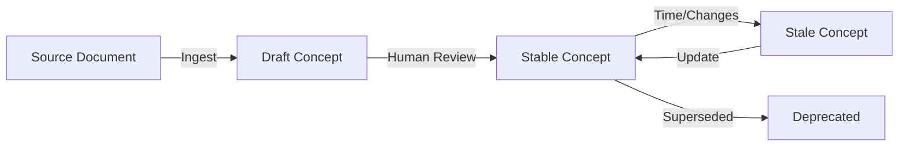

# Understanding Concepts

A **concept** is the fundamental unit of knowledge in Compendium. Each concept is a markdown file with YAML frontmatter, following the [Open Knowledge Format (OKF)](https://github.com/GoogleCloudPlatform/knowledge-catalog/blob/main/okf/SPEC.md).

## Anatomy of a Concept

```markdown
---
type: System
title: "Order Management System"
description: "Handles customer orders from placement through fulfillment"
tags: [imported, critical-path]
status: stable
generated:
  by: process:compendium-ingest/0.1
  at: 2026-08-16T10:30:00Z
sources:
  - id: confluence
    resource: /references/oms-wiki-page.html
    title: "OMS Wiki Page"
---

# Overview

The Order Management System (OMS) is the core system for processing customer orders...

## Dependencies

- Payment Gateway (Stripe)
- Inventory System
- Shipping Provider (FedEx, UPS)

## Integrations

- Receives orders from: Web Store, Mobile App
- Sends fulfillment data to: Warehouse Management System
```

## Frontmatter Fields

### Required

- **`type`** — The concept type (e.g., "System", "Process", "Integration", "Data Map")
- **`title`** — Human-readable name

### Recommended

- **`description`** — One-line summary (auto-generated from content if missing)
- **`tags`** — Categorization tags
- **`status`** — Lifecycle state:
    - `draft` — Unverified, agent-generated
    - `stable` — Reviewed and approved
    - `deprecated` — Superseded or retired
- **`generated`** — Attribution metadata
    - `by` — Who/what created this (e.g., `agent:compendium/0.1`, `user:john`, `process:ingest`)
    - `at` — UTC timestamp
- **`sources`** — Provenance links
    - `id` — Source identifier
    - `resource` — Path to original file in `/references/`
    - `title` — Human-readable source name

### Optional

- **`stale_after`** — Date after which this concept should be reviewed
- **`verified`** — Verification metadata
    - `by` — Who verified
    - `at` — When verified
- **`links`** — Relationships to other concepts

## Concept Types

Organize concepts by type. Common types:

### System
An application, service, or database.

**Example:** "Customer Portal", "Payment Gateway", "Analytics Database"

### Integration
A connection between systems that moves or transforms data.

**Example:** "Orders to Warehouse", "CRM to Marketing Platform"

### Process
A business process or workflow.

**Example:** "Order Fulfillment", "Employee Onboarding", "Monthly Close"

### Data Map
Field-level data lineage documentation.

**Example:** "ProjectSync", "ContractsSync"

### Custom Types
Define your own types based on your domain:

- Architecture Element
- API Endpoint
- Data Pipeline
- Report
- Team
- Document

## Concept Lifecycle



### Draft
- Created by ingestion or agent
- Not yet verified by humans
- May contain inaccuracies
- Shows in "Review" UI for approval

### Stable
- Reviewed and approved by a human
- Trustworthy for agent reasoning
- Can be linked and referenced

### Deprecated
- Marked as outdated or superseded
- Retained for historical context
- Links preserved but flagged

## File Organization

Concepts are stored in type-specific directories:

```
my-bundle/
├── systems/
│   ├── order-management.md
│   └── payment-gateway.md
├── integrations/
│   ├── orders-to-warehouse.md
│   └── crm-to-marketing.md
├── data-maps/
│   ├── projectsync.md
│   └── contractssync.md
└── references/
    ├── oms-wiki.html
    └── integration-catalog.csv
```

## Concept IDs

Each concept has a unique ID derived from its file path:

- File: `systems/order-management.md`
- ID: `systems/order-management`

IDs are used for linking concepts together.

## Linking Concepts

Concepts can reference each other using markdown links:

```markdown
## Dependencies

This integration depends on:
- [Order Management System](../systems/order-management.md)
- [Payment Gateway](../systems/payment-gateway.md)
```

The agent can follow these links when reasoning about relationships.

## Best Practices

1. **One concept, one file** — Don't combine multiple systems/processes into one concept
2. **Stable before linking** — Review concepts before linking to them
3. **Keep descriptions concise** — One sentence is ideal
4. **Tag consistently** — Use the same tags across similar concepts
5. **Update stale_after** — Set review dates for time-sensitive knowledge
6. **Preserve sources** — Always track where knowledge came from
