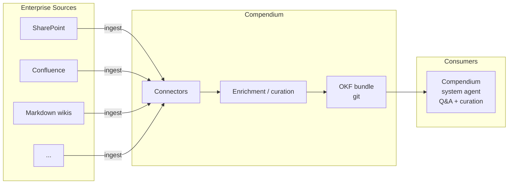

<div class="fuseraft-section" markdown>

## What is Compendium?

Compendium helps enterprise architects connect AI agents to the documents their organization already has — scattered across SharePoint sites, Confluence spaces, wikis, and shared drives — and turn them into a living, agent-curated map of the business.
{: .fuseraft-section-lead }

<div class="grid cards" markdown>

-   :material-file-document-outline:{ .lg .middle } **OKF-First**

    ---

    Every concept is a plain markdown file with YAML frontmatter, conforming to the [Open Knowledge Format](https://github.com/GoogleCloudPlatform/knowledge-catalog/blob/main/okf/SPEC.md) — readable without Compendium, version-controlled in git, and portable with no proprietary store in between.

    [:octicons-arrow-right-24: OKF Format](features/okf.md)

-   :material-lan-connect:{ .lg .middle } **Multi-Source Connectors**

    ---

    Connect to SharePoint sites, Confluence spaces, markdown wikis, local file systems, and git repositories, transforming source documents into OKF concepts while preserving provenance.

    [:octicons-arrow-right-24: Connectors](features/connectors.md)

-   :material-chart-timeline-variant:{ .lg .middle } **Data Lineage Tracking**

    ---

    Built-in data maps document field-level data flows — automatic detection and grouping by integration, source/destination tracking, transformation logic, and graph-based lineage queries.

    [:octicons-arrow-right-24: Data Lineage](features/data-lineage.md)

-   :material-robot-outline:{ .lg .middle } **AI Agent**

    ---

    The Compendium system agent curates the catalog — ingesting documents, creating concepts, linking relationships, flagging stale knowledge — and answers questions grounded in the catalog with traceable sources.

    [:octicons-arrow-right-24: AI Agent](features/agent.md)

-   :material-file-multiple-outline:{ .lg .middle } **14+ File Formats**

    ---

    Ingest documents (`.txt`, `.md`, `.pdf`, `.docx`), data (`.json`, `.xml`, `.csv`, `.xlsx`), email (`.eml`, `.msg`, `.ost`), diagrams (`.drawio`, `.vsdx`), and architecture models (`.archimate`).

    [:octicons-arrow-right-24: Supported Formats](reference/formats.md)

-   :material-shield-check-outline:{ .lg .middle } **Trustable at Scale**

    ---

    Provenance, trust, and lifecycle fields keep knowledge honest as more of the catalog is written by agents rather than people — every concept knows where it came from and whether it's gone stale.

    [:octicons-arrow-right-24: Concepts](guide/concepts.md)

</div>
</div>

---

## Quick start

=== "Linux / macOS"

    ```bash
    ./build.sh
    compendium init
    ./bin/web/Compendium.Web
    ```

=== "Windows"

    ```powershell
    .\build.ps1
    compendium init
    .\bin\web\Compendium.Web.exe
    ```

Or use the CLI directly:

```bash
compendium chat --bundle catalog/sample
```

[:octicons-arrow-right-24: Full installation guide](getting-started/installation.md)

---

## Documentation

| Doc | What it covers |
|-----|----------------|
| [Installation](getting-started/installation.md) | Prerequisites, build, first run |
| [Quick Start](getting-started/quickstart.md) | Up and running in 5 minutes |
| [Configuration](getting-started/configuration.md) | LLM provider setup and config schema |
| [Concepts](guide/concepts.md) | The anatomy of an OKF concept |
| [Ingestion](guide/ingestion.md) | Turning source documents into concepts |
| [Data Maps](guide/data-maps.md) | Field-level data lineage across integrations |
| [Chat Interface](guide/chat.md) | Querying and curating the catalog conversationally |
| [Web UI](guide/web-ui.md) | The Blazor Server catalog browser |
| [CLI](guide/cli.md) | Command-line reference |
| [OKF Format](features/okf.md) | The Open Knowledge Format bundle spec |
| [Connectors](features/connectors.md) | SharePoint, Confluence, wikis, file systems |
| [Data Lineage](features/data-lineage.md) | Data governance and impact analysis |
| [AI Agent](features/agent.md) | Catalog curation and grounded Q&A |
| [Building](development/building.md) | Building Compendium from source |
| [Architecture](development/architecture.md) | System design and component interactions |
| [Contributing](development/contributing.md) | How to contribute code and docs |
| [Supported Formats](reference/formats.md) | Format support matrix |
| [API](reference/api.md) | REST API reference |

---

## Architecture



---

## Use Cases

- **Enterprise Architecture Documentation** — Catalog systems, processes, and integrations
- **Data Governance** — Track data lineage and field-level flows
- **Knowledge Management** — Connect scattered documentation into a coherent graph
- **AI-Assisted Research** — Enable agents to answer questions with source attribution
- **Onboarding** — Help new team members understand the enterprise landscape

## Status

Compendium is in early preview. See the [GitHub repository](https://github.com/fuseraft/compendium) for current progress and roadmap.

## License

Open source software. See [LICENSE](https://github.com/fuseraft/compendium/blob/main/LICENSE) for details.
